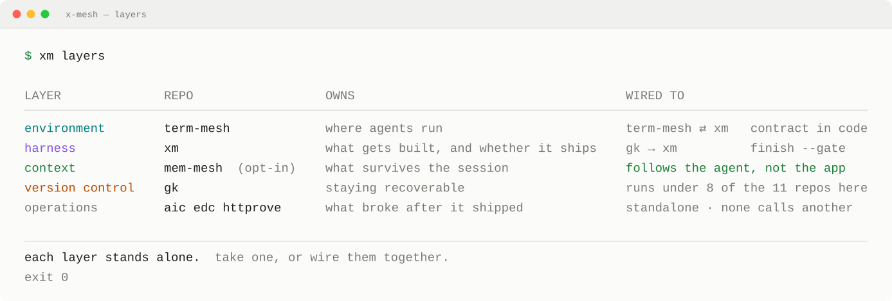
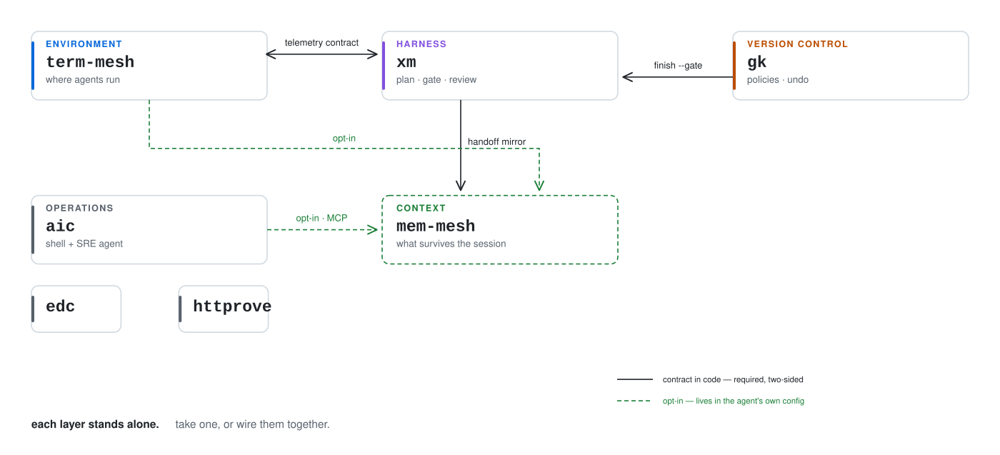
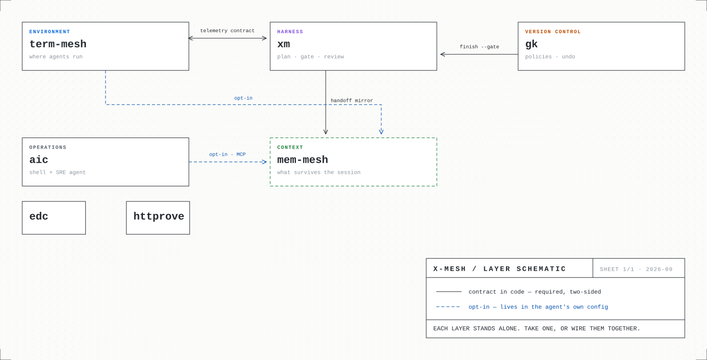
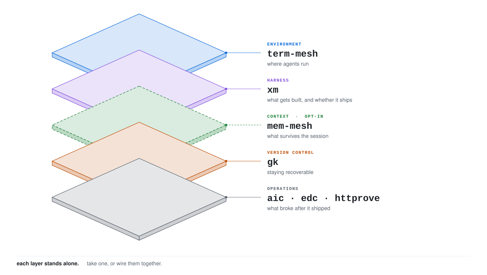
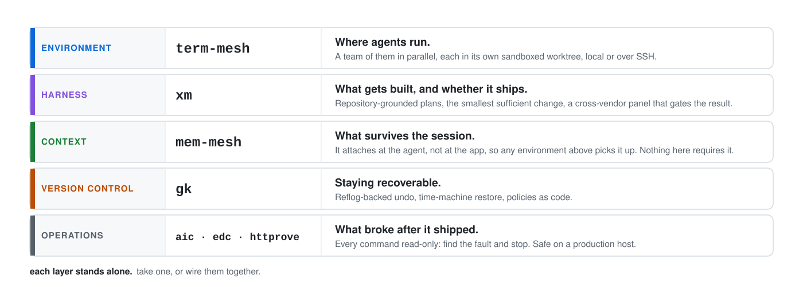
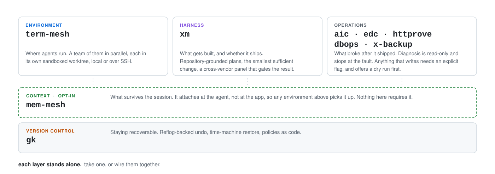
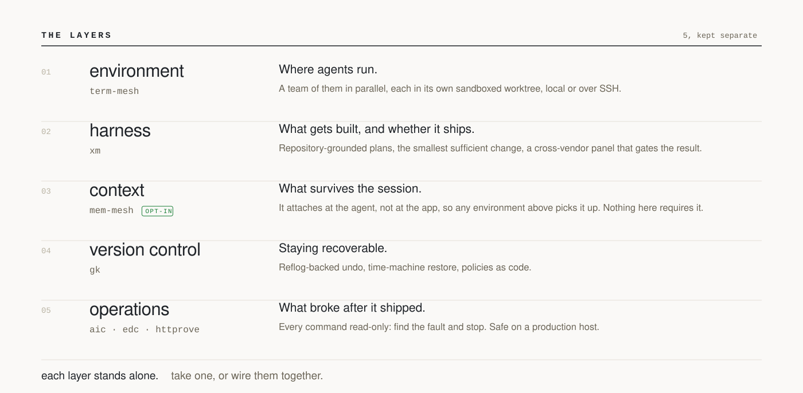

<h1 align="center">card</h1>

<p align="center">
  <strong>Render an architecture card as SVG. Then stop.</strong>
</p>

<p align="center">
  No browser, no rasterizer, no fonts to ship, no runtime dependencies.<br>
  A number it cannot measure is a number it refuses to print.
</p>

---

## What it is

One config file describes a set of layers and how they connect. Four templates
render that same description four different ways. The output is a single SVG you
commit, so the picture in your README is a file in your repository rather than a
request to a service that might be down.

```bash
npx @x-mesh/card render --config examples/x-mesh.json --template terminal --out layers.svg
npx @x-mesh/card serve  --config examples/x-mesh.json     # compare all seven, light and dark
```

## Templates

```console
$ card list
terminal     Command output in a terminal window. Dark, monospace, column-aligned.
graph        Rounded nodes, labelled edges, legend. Light.
schematic    Engineering drawing. Hairlines, dot grid, title block.
isometric    Layers as stacked slabs with leader lines. Light.
stack        One band per layer. Fastest to read, carries no connections.
rails        Independent parts on top, shared rails underneath. Light.
editorial    Numbered entries, no boxes. Quietest, carries no connections.
```

<p align="center">
  <picture>
    <source media="(prefers-color-scheme: dark)" srcset="./examples/out/terminal.dark.svg">
    
  </picture>
</p>

<details>
<summary>graph · schematic · isometric · stack · rails · editorial</summary>

<br>

<p align="center">
  <br><br>
  <br><br>
  <br><br>
  <br><br>
  <br><br>
  
</p>

</details>

## Two variants, one drawing

Every template declares a light and a dark palette, so a card does not become a
white slab the moment a reader has GitHub in dark mode. Only colour changes
between them; geometry that moved with the theme would be two drawings to keep
in step instead of one.

```bash
card render --config card.json --template graph --out graph.svg
card render --config card.json --template graph --dark --out graph.dark.svg
```

```markdown
<picture>
  <source media="(prefers-color-scheme: dark)" srcset="graph.dark.svg">
  
</picture>
```

## Measured, not remembered

A card that says *"runs under 8 of the 10 repositories here"* and reads that
number from its own config is indistinguishable from one that counted. So it
counts. Declare the measurement and the renderer performs it against the live
organization:

```json
{
  "id": "version control",
  "repos": ["gk"],
  "measure": {
    "kind": "fileInRepos",
    "path": ".gk.yaml",
    "template": "runs under {hit} of the {total} repos here"
  }
}
```

`--offline` does not fall back to a stored value. It fails:

```console
$ card render --config examples/x-mesh.json --template terminal --offline
card: version control: has a measured field but --offline was requested.
      Refusing to print a number that was not measured.
```

The same rule applies to drift. A repository named in config but absent from the
organization stops the render instead of quietly disappearing from the picture.

## Usage

```
card list
card render --config <file> [--template <name> --out <file>]
            [--all --out-dir <dir>] [--dark] [--check] [--offline]
card serve  --config <file> [--port <n>]
```

| Flag | Effect |
| --- | --- |
| `--all` | render every template, both variants, into `--out-dir` (default `./out`) |
| `--dark` | render the dark variant; light is the default |
| `--check` | exit 1 when the file on disk differs from what would be written |
| `--offline` | skip the GitHub API; error on any measured field |
| `--port` | preview port, default 8787 |

`GITHUB_TOKEN` is optional. Without it the unauthenticated rate limit applies.

## Keep it fresh

`--check` is the CI half. Render on a schedule and commit only when the bytes
change:

```yaml
- run: npx @x-mesh/card render --config profile/card.json --template terminal --out profile/assets/layers.svg
  env:
    GITHUB_TOKEN: ${{ secrets.GITHUB_TOKEN }}
- run: |
    git diff --quiet -- profile/assets/layers.svg && exit 0
    git config user.name "github-actions[bot]"
    git config user.email "41898282+github-actions[bot]@users.noreply.github.com"
    git commit -am "chore: refresh card" && git push
```

## Why a committed file and not a service

A dynamic endpoint looks like the obvious answer and is not. GitHub proxies
README images through Camo and caches them hard, so a card served from a URL is
not fresher than one committed weekly — it is the same staleness plus an
outage mode on your front page. `github-readme-stats` reached 80k stars proving
this the hard way, and now [recommends the Actions route](https://github.com/anuraghazra/github-readme-stats#deploy-on-your-own-recommended)
over its own public instance.

A preview server is a different question, and a good one. `card serve` is that:
every template on one page, the config re-read on each request, and a
**re-measure** button for when you want to pay for the API call. It renders each
template separately, so one that cannot lay out prints why in its own frame
instead of leaving a broken image and putting the reason in a terminal nobody is
watching. Preview here, commit the file there.

## Design notes

- **Attributes, not `<style>`.** An SVG referenced as an image is a separate
  document. Attributes survive every sanitizer it may be served through.
- **Derived column positions.** Hand-tuned offsets are how a column silently
  starts overlapping the next one the first time a description gets longer.
- **Declared node positions.** A seven-node diagram does not need a layout
  engine, and a grid keeps the output byte-identical between runs.
- **Lanes.** Two edges entering the same side of the same node get separate
  entry points, because one arrowhead on top of another reads as one edge.
- **Names wrap, they do not shrink.** A layer that lists four tools is normal.
  Shrinking the type until they fit one line hides the thing a reader came for,
  so the list breaks between items -- never after a separator -- and the row
  grows.
- **A legend of what is drawn, not of what exists.** Only the edge kinds the
  diagram actually uses get a legend row. A row for an unused kind describes the
  vocabulary and sends the reader hunting for an edge that is not there.
- **Wrapping that admits what it does not know.** SVG has no reflow, so a
  paragraph has to be broken before it is written, in a font the viewer picks.
  Proportional text is measured against Helvetica advance widths and inflated
  by a safety margin, so a wider fallback face still fits the box. A word that
  cannot fit its column at all raises, naming the word and both measurements.

## Known limits

- Widths are estimated, not measured against the viewer's actual font. The
  safety margin covers the faces a system stack normally resolves to; a font
  substantially wider than Helvetica can still overflow.
- `card serve` is local only, and meant to stay that way. It is for choosing a
  template, not for serving one into a README.

## License

MIT
